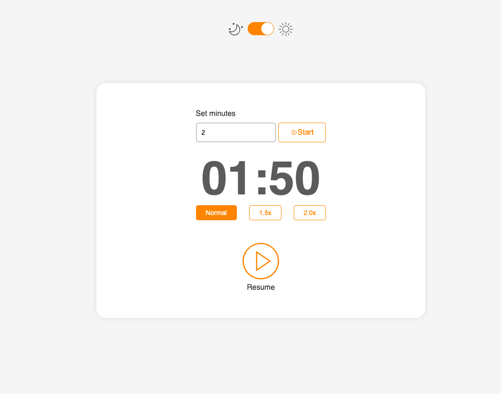
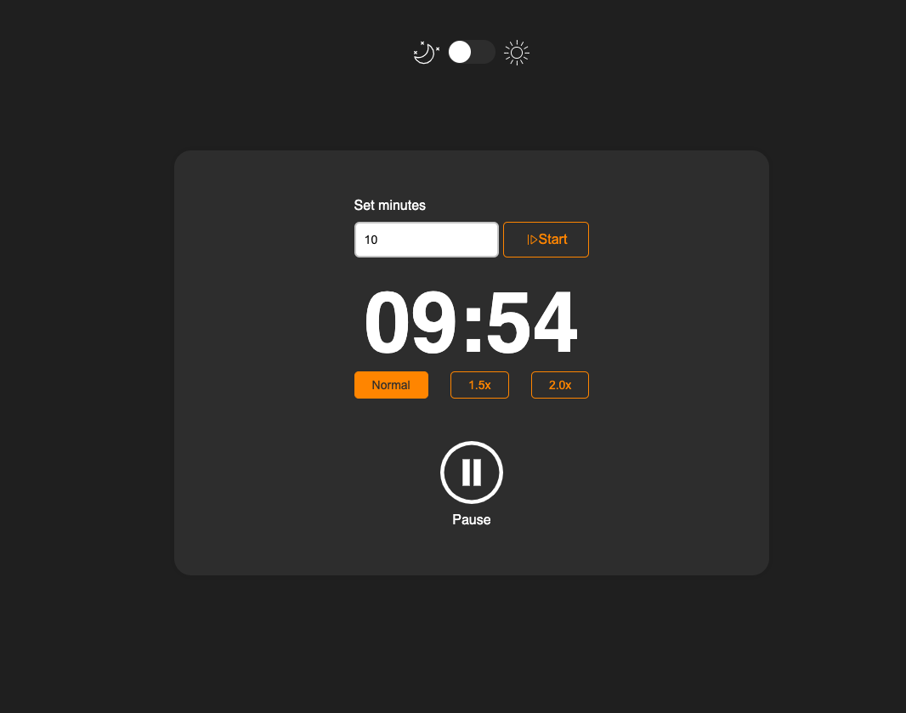
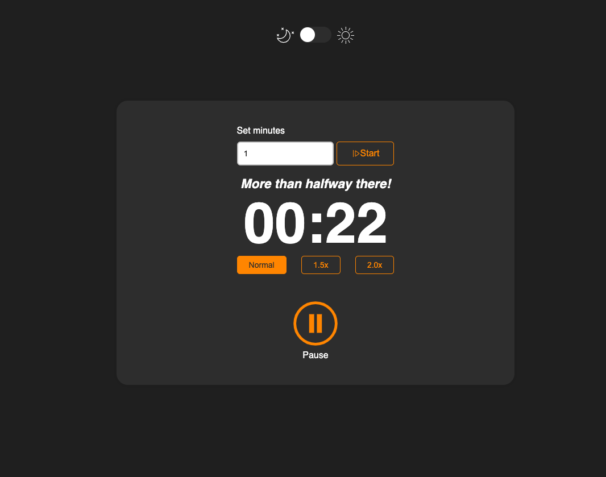
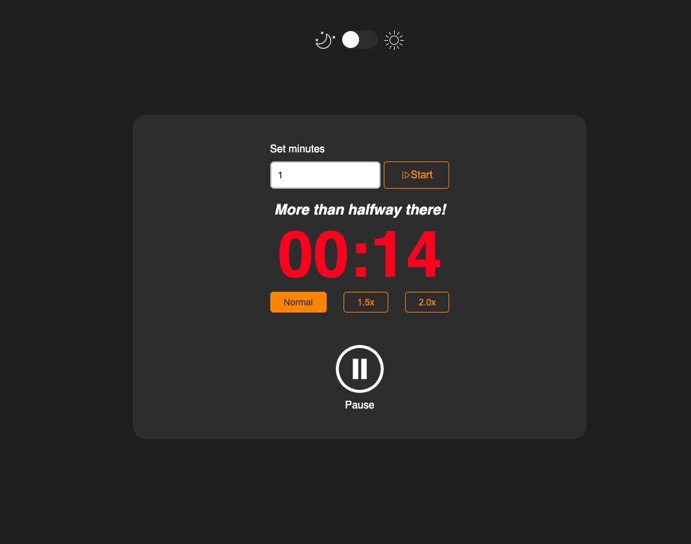
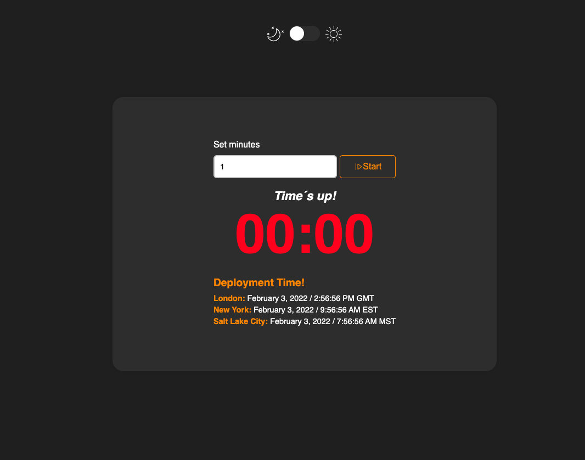

# Countdown Timer

## ⚙️ Features

<p> ✅  Countdown Timer </p>
<p> ✅  Pause and Resume </p>
<p> ✅  Speed Selector </p>
<p> ✅  Dark theme </p>
<p> ✅  Datetime by timezone </p>

<br>

## 🚀 Technologies

- [TypeScript](https://www.typescriptlang.org/)
- [ReactJS](https://reactjs.org/)
- [Styled-Components](https://styled-components.com/)
- [Jest](https://jestjs.io/)
- [Enzyme](https://enzymejs.github.io/enzyme/)
- [Sinon](https://sinonjs.org/)
- [ESLint](https://eslint.org/)
- [React Switch](https://www.npmjs.com/package/react-switch)

<br>

## 🚀 Design Patterns

- Design Tokens
- Context API
- Hooks
- Themes

<br>

## 📸 Screens

<p align="center">
 
</p>
<hr>
<p align="center">
 
</p>
<hr>
<p align="center">
 
</p>
<hr>
<p align="center">
 
</p>
<p align="center">
 
</p>

## ⚡ Usage

```bash
# install all dependencies
$ yarn

# run react on localhost:3000
$ yarn start

# to run tests
$ yarn test

# run the follow codes for production
$ yarn build
$ yarn start

```
